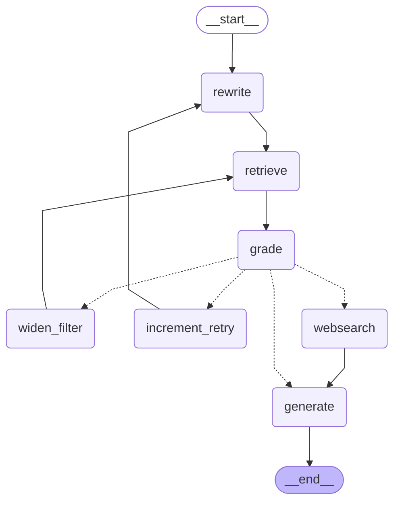

# Common Workflow Structure

```mermaid
%%{init: {'flowchart': {'curve': 'linear'}}}%%
graph TD;
	__start__([<p>__start__</p>]):::first
	rewrite(rewrite)
	retrieve(retrieve)
	grade(grade)
	widen_filter(widen_filter)
	increment_retry(increment_retry)
	websearch(websearch)
	generate(generate)
	__end__([<p>__end__</p>]):::last
	__start__ --> rewrite;
	generate --> __end__;
	increment_retry --> rewrite;
	retrieve --> grade;
	rewrite --> retrieve;
	websearch --> generate;
	widen_filter --> retrieve;
	grade -.-> widen_filter;
	grade -.-> increment_retry;
	grade -.-> websearch;
	grade -.-> generate;
	classDef default fill:#f2f0ff,line-height:1.2
	classDef first fill-opacity:0
	classDef last fill:#bfb6fc

```
